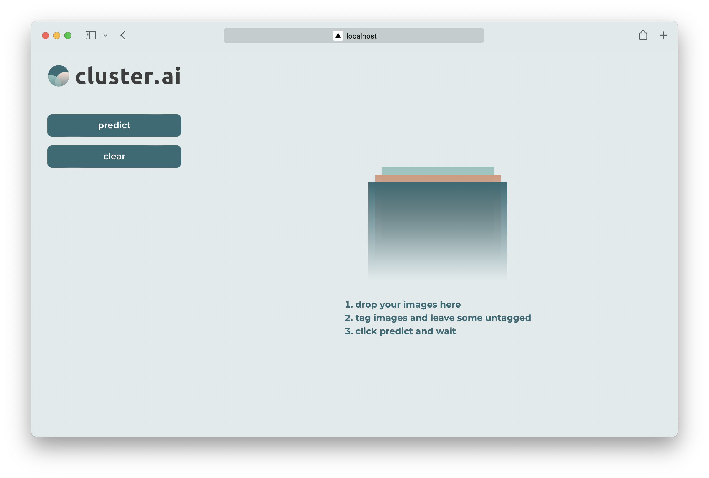
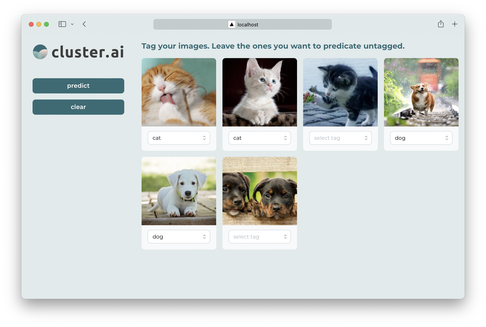
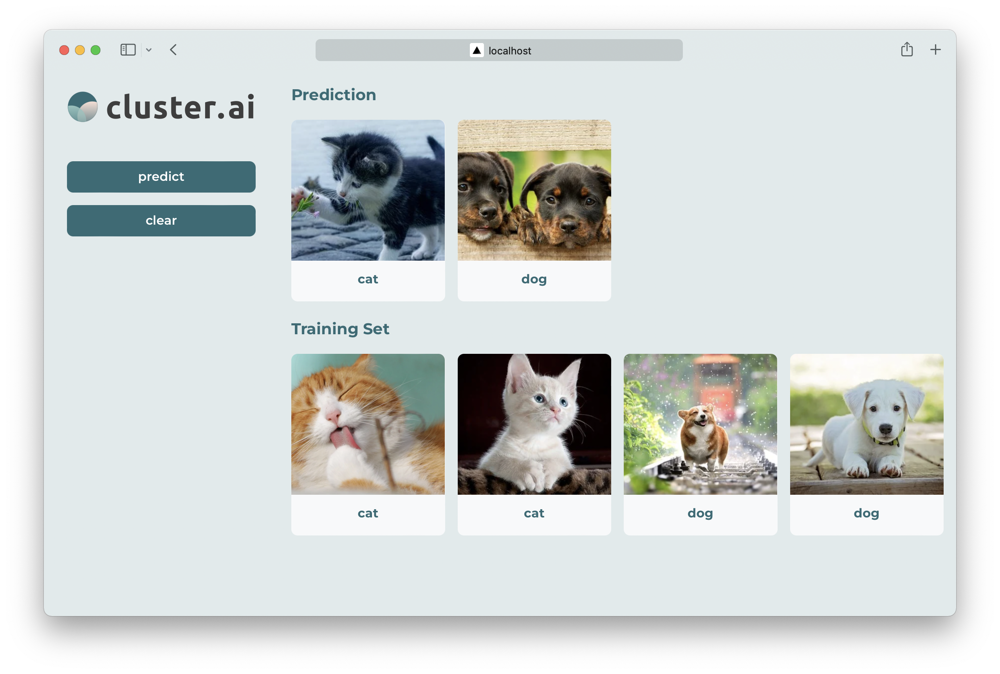

# cluster.ai

_cluster.ai_ is an out-of-the-box machine learning app for solving simple machine learning tasks.

## How to use

1. Drag and drop your images to _cluster.ai_.
   
2. Tag images. Leave those you want to classify untouched.
   
3. Click `predict`.
   

## In Development

More features are on the way.
